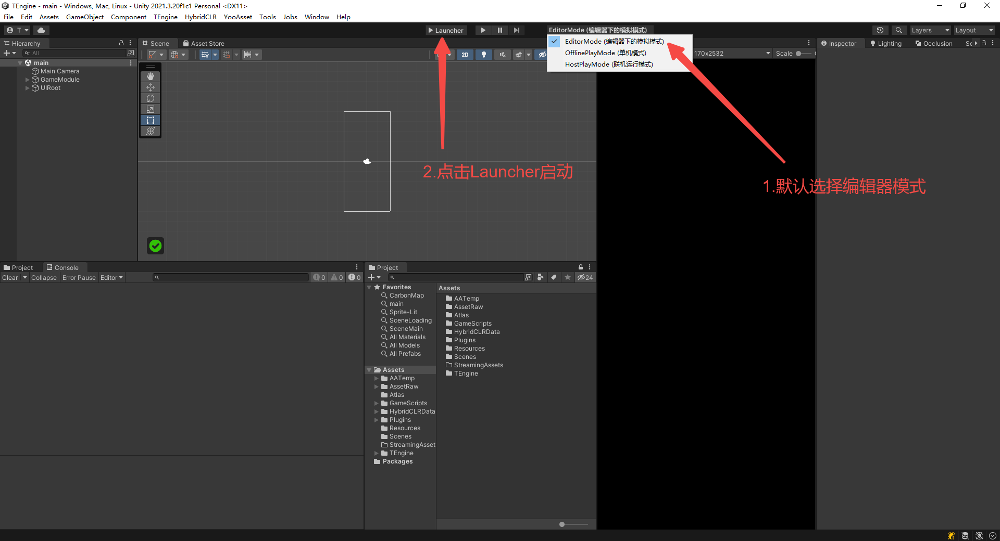
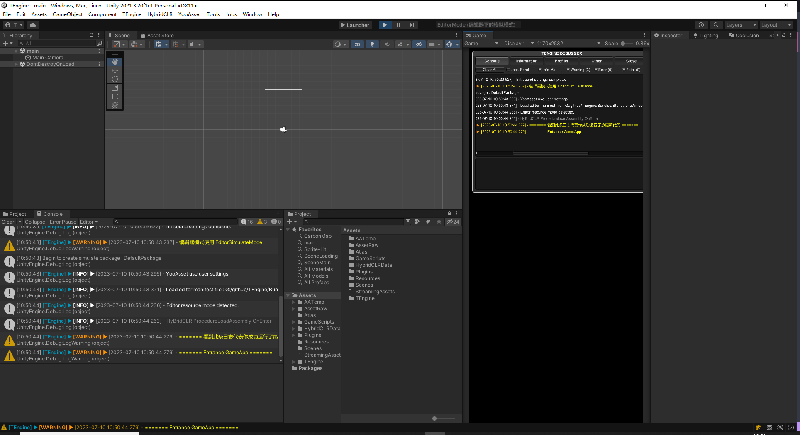

# 快速开始- Quickly Start
快速上手
本教程引导从空项目开始体验TEngine。出于简化起见，只演示目标平台为Windows的情况。

请在Standalone平台上正确跑通热更新流程后再自行尝试Android、iOS平台的热更新，它们的流程非常相似。

### 1.使用Unity2021.3.20f1c1打开项目工程。

### 2.默认选择顶部栏目EditorMode编辑器下的模拟模式并点击Launcher开始运行


### 3.Editor编辑器下运行成功！


### 4.打包运行
 *   1.运行菜单 HybridCLR/Define Symbols/Enable HybridCLR 运行开启HybridCLR热更新
 *   2.运行菜单 HybridCLR/Generate/All 进行必要的生成操作。这一步不可遗漏!!!
 *   3.运行菜单 HybridCLR/Build/BuildAssets And CopyTo AssemblyPath，生成热更新dll并copy到热更程序集中。
 *   4.运行菜单 YooAsset/AssetBundle Builder 构建AB
 *   5.打开Build Settings对话框，点击Build And Run，打包并且运行热更新示例工程。
    
### 遇到问题请查看HybridlCLR的<a href="https://hybridclr.doc.code-philosophy.com/docs/help/commonerrors"><strong>常见错误(commonerrors)</strong></a>

### 系统需求
默认版本：Unity2021.3.20f1c1 

支持版本: Unity2019.4 & Unity2020.3 & Unity2021.3 & Unity2022.3

支持平台: Windows、OSX、Android、iOS、WebGL

开发环境: .NET4.x

### 目录结构
```
Assets
├── AssetRaw        资源目录
├── Atlas           图集目录
├── GameScripts     热更程序集目录
├── Scenes          主场景目录
└── TEngine              
    ├── AssetSetting        YooAsset资源设置  
    ├── Editor              TEngine-Editor程序集
    └── Runtime             TEngine-Runtime程序集
```

### 热更新程序集划分
```
Assets/GameScripts
├── Editor              编辑器程序集
├── HotFix              游戏热更程序集目录 [Folder]
|   ├── GameBase        游戏基础框架程序集 [Dll]
|   ├── GameProto       游戏配置协议程序集 [Dll]  
|   ├── BattleCore      游戏核心战斗程序集 [Dll] 
|   └── GameLogic       游戏业务逻辑程序集 [Dll]
|           ├── GameApp.cs                  热更主入口
|           └── GameApp_RegisterSystem.cs   热更主入口注册系统
└── Runtime             Runtime程序集
```