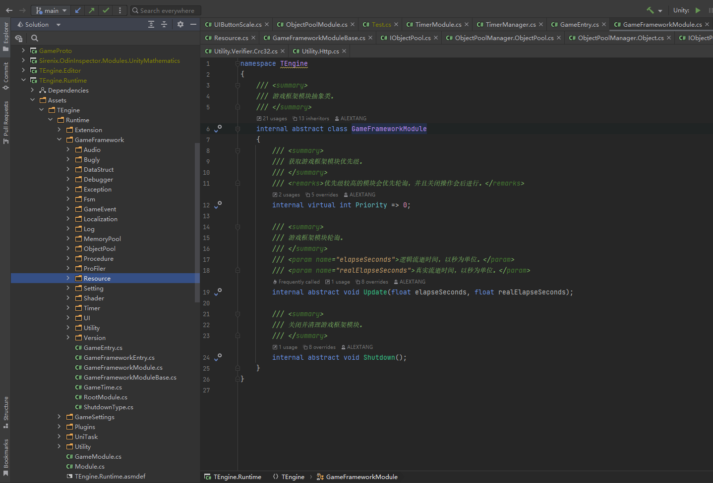

# TEngine

## TEngine-Runtime
### AOT内核基于Gameframework,优化、最简化以及商业化适配。


## AOT游戏框架模块基类。
#### 框架思路为面向接口编程，如Resource资源模块，开发白皮书为先定义IResourceManager的接口规范，然后编写ResourceManager继承框架具体实现(ModuleImp)以及实现接口。最后实现调用层Module，调用层可以拓展编辑器供开发者自定义模块参数。
``` csharp
/// <summary>
/// 游戏框架模块抽象类。ModuleImp为具体框架模块实现。
/// </summary>
internal abstract class ModuleImp
{
    /// <summary>
    /// 获取游戏框架模块优先级。
    /// </summary>
    /// <remarks>优先级较高的模块会优先轮询，并且关闭操作会后进行。</remarks>
    internal virtual int Priority => 0;

    /// <summary>
    /// 游戏框架模块轮询。
    /// </summary>
    /// <param name="elapseSeconds">逻辑流逝时间，以秒为单位。</param>
    /// <param name="realElapseSeconds">真实流逝时间，以秒为单位。</param>
    internal abstract void Update(float elapseSeconds, float realElapseSeconds);

    /// <summary>
    /// 关闭并清理游戏框架模块。
    /// </summary>
    internal abstract void Shutdown();
}

//=====================================================================//

/// <summary>
/// 游戏框架模块抽象类。Module 为Mono调用层。
/// </summary>
public abstract class Module : MonoBehaviour
{
    /// <summary>
    /// 游戏框架模块初始化。
    /// </summary>
    protected virtual void Awake()
    {
        ModuleSystem.RegisterModule(this);
    }
}
```

## 热更域程序集设计与说明
```
Assets/GameScripts
├── Main                // 主程序程序集(启动器与流程)
└── HotFix              // 游戏热更程序集目录 [Folder]
    ├── GameBase        // 游戏基础框架程序集 [Dll]
    ├── GameProto       // 游戏配置协议程序集 [Dll]
    └── GameLogic       // 游戏业务逻辑程序集 [Dll]
            ├── GameApp.cs                  热更主入口
            └── GameApp_RegisterSystem.cs   热更主入口注册系统
```
游戏内主要玩法逻辑包括UI会在GameLogic中编写，GameBase则存放一些通用性的逻辑，GameProto存放与服务区交互的协议以及配置表逻辑。若有项目需求完全可以进行自定义增删HotFix程序集。

PS：注意增删程序集后需要同步到HybridClr的Setting面板以及TEngineSetting的面板。TEngineSettings面板有按钮可以从HybridClr中同步AOT与热更程序集。

## 常用模块接口

<strong>[3-1-资源模块](./3-1-资源模块.md)<strong>

<strong>[3-2-事件模块](./3-2-事件模块.md)<strong>

<strong>[3-3-内存池模块](./3-3-内存池模块.md)<strong>

<strong>[3-4-对象池模块](./3-4-对象池模块.md)<strong>

<strong>[3-5-UI模块](./3-5-UI模块.md)<strong>

<strong>[3-6-配置表模块](./3-6-配置表模块.md)<strong>

<strong>[3-7-流程模块](./3-7-流程模块.md)<strong>

<strong>[3-8-网络模块](./3-8-网络模块.md)<strong>
