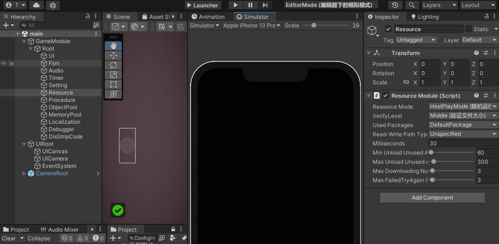
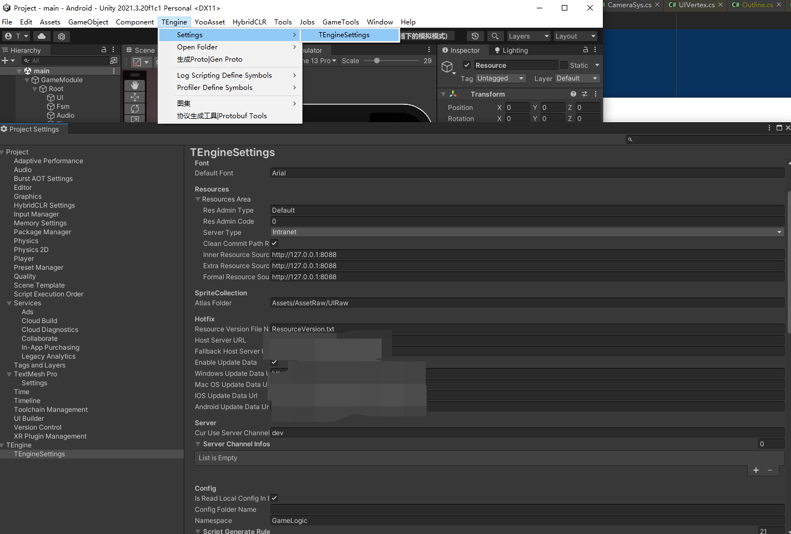

## 3-1.资源模块 - ResourceModule
资源模块运行模式有EditorSimulateMode、OfflinePlayMode以及HostPlayMode
编辑器模式下以顶部导航栏的选项卡为优先选项，打包后以Scene场景中ResourceModule脚本的Enum选项卡为优先选项(打包后不会走EditorSimulateMode)

cene窗口Resource对象可以设置一些资源模块的常用设置，比如打包后的资源模式、资源校验等级以及自动卸载资源间隔等。


Menu窗口TEngineSetting可以设置一些资源模块的热更新设置，比如资源服务器地址以及在线参数等。备注在Luban目录下有一个基于Node的静态文件服务器，可以把在线参数以及AB放入用于做热更新测试。



常用接口
remark：资源模块初始化的生命周期已经在流程模块实现了，具体有需求可以自定义开发。
``` csharp
/// <summary>
/// 获取当前资源包版本。
/// </summary>
/// <returns>资源包版本。</returns>
public string GetPackageVersion();

/// <summary>
/// 异步更新最新包的版本。
/// </summary>
/// <param name="appendTimeTicks">请求URL是否需要带时间戳。</param>
/// <param name="timeout">超时时间。</param>
/// <returns>请求远端包裹的最新版本操作句柄。</returns>
public UpdatePackageVersionOperation UpdatePackageVersionAsync(bool appendTimeTicks = false, int timeout = 60);

/// <summary>
/// 向网络端请求并更新清单
/// </summary>
/// <param name="packageVersion">更新的包裹版本</param>
/// <param name="autoSaveVersion">更新成功后自动保存版本号，作为下次初始化的版本。</param>
/// <param name="timeout">超时时间（默认值：60秒）</param>
public UpdatePackageManifestOperation UpdatePackageManifestAsync(string packageVersion, bool autoSaveVersion = true, int timeout = 60);

/// <summary>
/// 创建资源下载器，用于下载当前资源版本所有的资源包文件。
/// </summary>
public ResourceDownloaderOperation CreateResourceDownloader();


/// <summary>
/// 清理包裹未使用的缓存文件。
/// </summary>
public ClearUnusedCacheFilesOperation ClearUnusedCacheFilesAsync();


/// <summary>
/// 清理沙盒路径。
/// </summary>
public void ClearSandbox();

/// <summary>
/// 强制执行释放未被使用的资源。
/// </summary>
/// <param name="performGCCollect">是否使用垃圾回收。</param>
public void ForceUnloadUnusedAssets(bool performGCCollect);

/// <summary>
/// 检查资源是否存在。
/// </summary>
/// <param name="assetName">要检查资源的名称。</param>
/// <returns>检查资源是否存在的结果。</returns>
public HasAssetResult HasAsset(string assetName);

/// 同步加载资源。
/// </summary>
/// <param name="assetName">要加载资源的名称。</param>
/// <typeparam name="T">要加载资源的类型。</typeparam>
/// <returns>资源实例。</returns>
T LoadAsset<T>(string assetName) where T : Object;

/// <summary>
/// 同步加载资源。
/// </summary>
/// <param name="assetName">要加载资源的名称。</param>
/// <param name="parent">父节点位置。</param>
/// <typeparam name="T">要加载资源的类型。</typeparam>
/// <returns>资源实例。</returns>
T LoadAsset<T>(string assetName, Transform parent) where T :Object;

/// <summary>
/// 同步加载资源。
/// </summary>
/// <param name="handle">资源操作句柄。</param>
/// <param name="assetName">要加载资源的名称。</param>
/// <typeparam name="T">要加载资源的类型。</typeparam>
/// <returns>资源实例。</returns>
T LoadAsset<T>(string assetName,out AssetOperationHandle handle) where T : Object;

/// <summary>
/// 同步加载资源。
/// </summary>
/// <param name="assetName">要加载资源的名称。</param>
/// <param name="handle">资源操作句柄。</param>
/// <param name="parent">父节点位置。</param>
/// <typeparam name="T">要加载资源的类型。</typeparam>
/// <returns>资源实例。</returns>
T LoadAsset<T>(string assetName, Transform parent,out AssetOperationHandle handle) where T :Object;

/// <summary>
/// 异步加载资源。
/// </summary>
/// <param name="assetName">要加载资源的名称。</param>
/// <param name="cancellationToken">取消操作Token。</param>
/// <typeparam name="T">要加载资源的类型。</typeparam>
/// <returns>异步资源实例。</returns>
UniTask<T> LoadAssetAsync<T>(string assetName,CancellationToken cancellationToken) where T : Object;

/// <summary>
/// 异步加载游戏物体。
/// </summary>
/// <param name="assetName">要加载的游戏物体名称。</param>
/// <param name="cancellationToken">取消操作Token。</param>
/// <returns>异步游戏物体实例。</returns>
UniTask<UnityEngine.GameObject> LoadGameObjectAsync(string assetName,CancellationToken cancellationToken);

/// <summary>
/// 同步加载资源并获取句柄。
/// </summary>
/// <param name="assetName">要加载资源的名称。</param>
/// <typeparam name="T">要加载资源的类型。</typeparam>
/// <returns>同步加载资源句柄。</returns>
AssetOperationHandle LoadAssetGetOperation<T>(string assetName) where T : Object;

/// <summary>
/// 异步加载资源并获取句柄。
/// </summary>
/// <param name="assetName">要加载资源的名称。</param>
/// <typeparam name="T">要加载资源的类型。</typeparam>
/// <returns>异步加载资源句柄。</returns>
AssetOperationHandle LoadAssetAsyncHandle<T>(string assetName) where T : Object;

/// <summary>
/// 同步加载子资源对象
/// </summary>
/// <typeparam name="TObject">资源类型</typeparam>
/// <param name="location">资源的定位地址</param>
public SubAssetsOperationHandle LoadSubAssetsSync<TObject>(string location) where TObject : UnityEngine.Object;

/// <summary>
/// 异步加载子资源对象
/// </summary>
/// <typeparam name="TObject">资源类型</typeparam>
/// <param name="location">资源的定位地址</param>
public SubAssetsOperationHandle LoadSubAssetsAsync<TObject>(string location) where TObject : UnityEngine.Object;

/// <summary>
/// 同步加载子资源对象
/// </summary>
/// <param name="assetInfo">资源信息。</param>
public SubAssetsOperationHandle LoadSubAssetsSync(AssetInfo assetInfo);

/// <summary>
/// 异步加载场景。
/// </summary>
/// <param name="location">场景的定位地址</param>
/// <param name="sceneMode">场景加载模式</param>
/// <param name="activateOnLoad">加载完毕时是否主动激活</param>
/// <param name="priority">优先级</param>
/// <returns>异步加载场景句柄。</returns>
SceneOperationHandle LoadSceneAsync(string location, LoadSceneMode sceneMode = LoadSceneMode.Single, bool activateOnLoad = true, int priority = 100);

/// <summary>
/// 异步加载场景
/// </summary>
/// <param name="assetInfo">场景的资源信息</param>
/// <param name="sceneMode">场景加载模式</param>
/// <param name="activateOnLoad">加载完毕时是否主动激活</param>
/// <param name="priority">优先级</param>
/// <returns>异步加载场景句柄。</returns>
SceneOperationHandle LoadSceneAsync(AssetInfo assetInfo, LoadSceneMode sceneMode = LoadSceneMode.Single, bool activateOnLoad = true, int priority = 100);
```