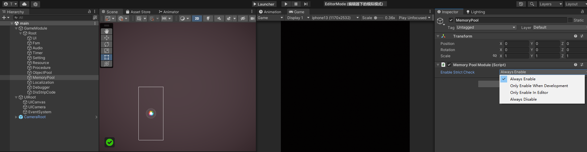

# 3-3.内存池模块 - MemoryPool
内存池更为轻量化，相对于对象池更适合一些更抽象碎片化的内存对象。

Scene窗口MemoryPool对象可以设置内存池检查，防止回收问题与内存泄漏问题。


使用案例
``` csharp
/// <summary>
/// 资源组数据。
/// <remarks>DisposeGroup。</remarks>
/// </summary>
public class AssetGroup : IMemory
{
    public void Clear(){}
}

//内存池中获取/生成内存对象。
AssetGroup assetGroup = MemoryPool.Acquire<AssetGroup>();

//释放内存对象还给内存池。
MemoryPool.Release(assetGroup);
```