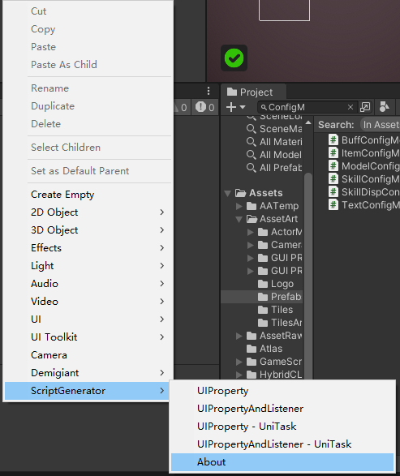
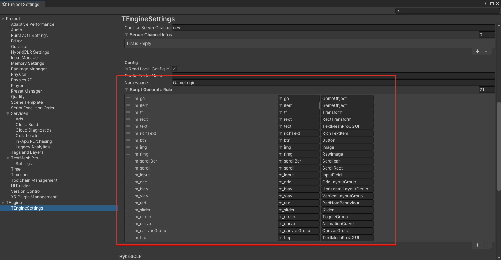
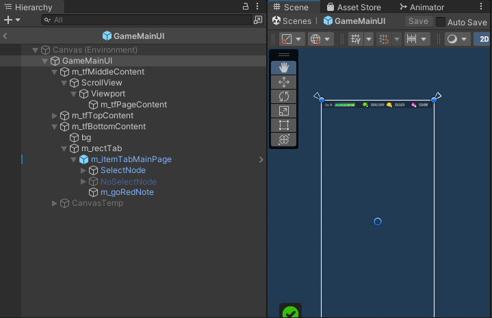
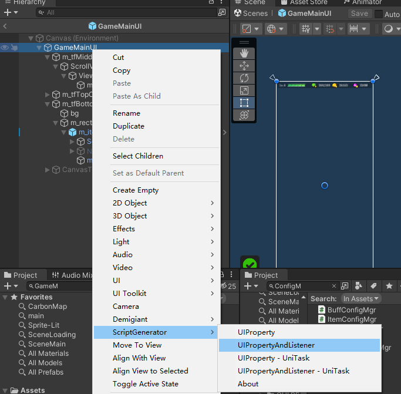
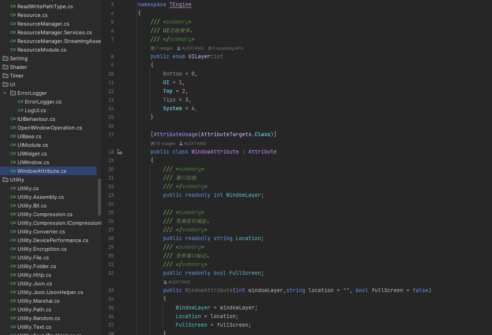

# 3-5.UI模块 - UIModule
一个游戏70%都是UI，剩下30%才是GamePlay，所以有一套简洁强大的商业化UI模块以及UI开发工作流将是项目的一大利器，能够提高至少一倍的开发效率。(配合事件模块实现MVE[Model - View - Event]事件驱动架构)

UI脚本为纯C#实现，脱离Mono的生命周期，由UIModule的帧更新驱动并管理UI的生命周期。

IUIBehaviour为UI通用行为接口、UIBase为UI基类、UIWindow为UI窗口基类，UIWidget为UI组件基类。

## 前期配置：
注意！！！！m_item节点为特殊节点表示是UI下的UIWidget组件，不会继续往下遍历生成UI代码。若需要这个UIWidget组件m_item的代码则在m_item右键生成这个组件的UI脚本。

Scene窗口下右键ScriptGenerator菜单下About目录有默认UI命名前缀规范。


有自定义需求可以在TEngineSetting下进行自定义。

### 开发工作流：
1.遵守前期默认配置或者自定义配置进行UI编排


2.在UI的根节点右键ScriptGenerator生成UI代码到剪贴板上！！！（注-使用-UniTask的生成代码可以做异步事件流驱动的UI。）


3.自行创建UI脚本到需要的目录下并复制UI脚本。

## 举例示范
``` csharp
// 同步打开面板
GameModule.UI.ShowUI<GameMainUI>([nullable]userData);

// 异步打开面板
GameModule.UI.ShowUIAsync<GameMainUI>([nullable]userData);

namespace GameLogic
{
    /// <summary>
    /// BattleMainUI面板
    /// <remarks>UIWindow需要以下特性，UILayer可以自行定义，fullScreen表示为全屏面板会停止和隐藏这个面板堆栈后面的面板。</remarks>
    /// </summary>
    [Window(UILayer.Bottom,fullScreen:true)]
    class BattleMainUI : UIWindow
    {
        private TouchMove m_touchView;
        
        #region 脚本工具生成的代码
        private RectTransform m_rectContainer;
        private GameObject m_itemTouch;
        private Button m_btnLeaveBattle;
        private GameObject m_goTopInfo;
        private Button m_btnPause;
        public override void ScriptGenerator()
        {
            m_rectContainer = FindChildComponent<RectTransform>("m_rectContainer");
            m_itemTouch = FindChild("m_rectContainer/m_itemTouch").gameObject;
            m_btnLeaveBattle = FindChildComponent<Button>("m_btnLeaveBattle");
            m_goTopInfo = FindChild("m_goTopInfo").gameObject;
            m_btnPause = FindChildComponent<Button>("m_goTopInfo/m_btnPause");
            m_btnLeaveBattle.onClick.AddListener(OnClickLeaveBattleBtn);
            m_btnPause.onClick.AddListener(OnClickPauseBtn);
        }
        #endregion

        #region 事件

        private void OnClickPauseBtn()
        {
            BattleSys.Instance.Pause = !BattleSys.Instance.Pause;
        }

        private void OnClickLeaveBattleBtn()
        {
            BattleSys.Instance.StopBattle(isBattleEnd:false,isWin:false);
        }
        #endregion

        //注册事件举例
        public override void RegisterEvent()
        {
            //通过AddUIEvent这样注册事件会把事件的生命周期绑定给面板，面板销毁的时候自动移除监听。
            AddUIEvent(ActorLogicEventDefined.OnMainPlayerBagDataChange, RefreshUI);
        }

        public override void BindMemberProperty()
        {
            //特殊的m_item节点的域不属于父级UIWindows，所以如注意所说需要同样创建这个UIWidget的脚本并生成代码过去。 可以如下创建或者走type、path创建。
            m_touchView = CreateWidget<TouchMove>(m_itemTouch);
        }

        ......
    }
}

namespace GameLogic
{
    /// <summary>
    /// 移动操作UIWidget。
    /// </summary>
    class TouchMove : UIWidget, IUICtrlMove
    {
        public override void BindMemberProperty()
        {
        }

        //注意Update只有在重写了此方法才会驱动这个Widget或者面板的Update。
        public override void OnUpdate()
        {
            TProfiler.BeginSample("CheckMoveTouchFinger");
            CheckMoveTouchFinger();
            TProfiler.EndSample();

            TProfiler.BeginSample("UpdateTouchMovePos");
            UpdateTouchMovePos();
            TProfiler.EndSample();

            TProfiler.BeginSample("UpdateKeyMove");
            UpdateKeyMove();
            TProfiler.EndSample();
        }
        ......
    }
}
```

## UI进阶
UI面板需要标记UIWindowAttribute，以标识层级(可以自行定义)和是否全屏。全屏面板则会把下层面板的Visible设置为false。


