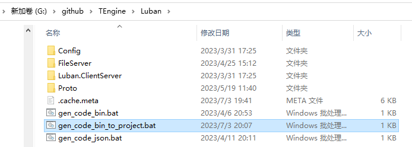
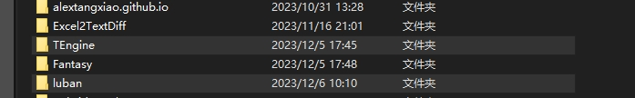
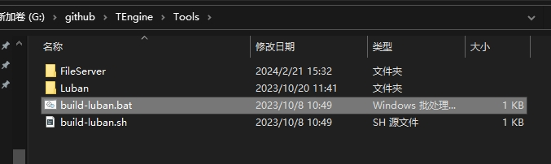

# 3-6.配置表模块 - ConfigSystem
接入最佳游戏配置解决方案 - <a href="https://github.com/focus-creative-games/luban"><strong>Luban</strong></a>

<a href="https://luban.doc.code-philosophy.com/#/manual/traits"><strong>Luban文档 </strong></a>

### 在TEngine中Luban配置表目录位于以下目录


### 安装luban配置表
1.在TEngine根目录同级克隆下最新的luban-next仓库。

2.Tools目录执行build-luban完成


3.转表则去luban配置目录执行对应bat

TEngine内置默认使用懒加载配置，也支持基于UniTask的异步加载，同步加载，包括服务器的Task异步加载，使用对应转表的bat即可。

### 介绍
luban是你的最佳游戏配置解决方案。

luban高效地处理游戏开发中常见的excel、json、xml之类的数据，检查数据错误，生成c#等各种语言的代码，导出成bytes或json等多种格式。

luban统一了游戏配置开发工作流，极大提升了策划和程序的工作效率。

核心特性
强大的数据解析和转换能力 {excel(csv,xls,xlsx)、json、bson、xml、yaml、lua、unity ScriptableObject} => {binary、json、bson、xml、lua、yaml、erlang、 custom format}
增强的excel格式，可以简洁地配置出像简单列表、子结构、结构列表，以及任意复杂的深层次的嵌套结构。
完备的类型系统，支持OOP类型继承，搭配excel、json、lua、xml等格式数据灵活优雅表达行为树、技能、剧情、副本之类复杂GamePlay数据
支持生成c#、java、go、c++、lua、python、javascript、typescript、erlang、rust、gdscript 代码
支持生成 protobuf(schema + binary + json)、flatbuffers(schema + json)、msgpack(binary)
强大的数据校验能力。ref引用检查、path资源路径、range范围检查等等
完善的本地化支持。静态文本值本地化、动态文本值本地化、时间本地化、main-patch多地区版本
强大灵活的自定义能力，支持自定义代码模板和数据模板
通用型生成和缓存工具。也可以用于生成协议、数据库之类的代码，甚至可以用作对象缓存服务。


---

使用案例
``` csharp
/// <summary>
/// 道具配置表管理器。
/// </summary>
public class ItemConfigMgr: Singleton<ItemConfigMgr>
{
    /// <summary>
    /// 道具Table。
    /// </summary>
    private TbItem TbItem => ConfigLoader.Instance.Tables.TbItem;

    /// <summary>
    /// 获取道具配置表。
    /// </summary>
    /// <param name="itemId">道具Id。</param>
    /// <returns>道具配置表。</returns>
    public ItemConfig GetItemConfig(int itemId)
    {
        TbItem.DataMap.TryGetValue(itemId, out var config);
        return config;
    }
}
```