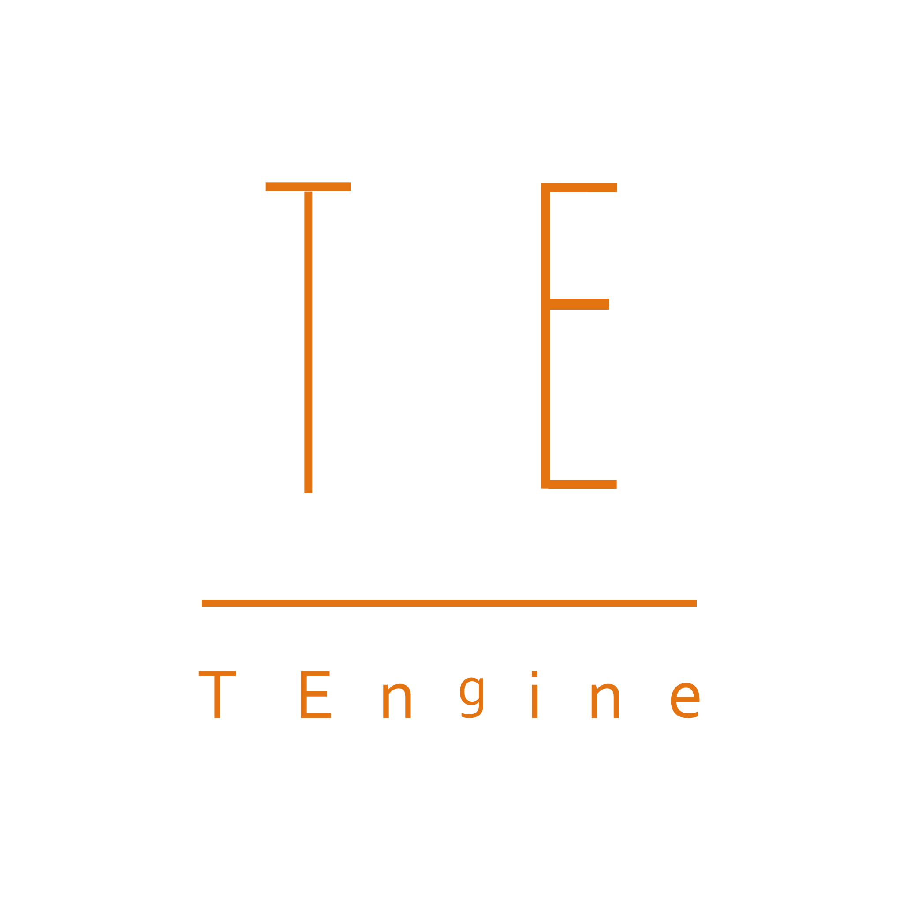

# TEngine
<p align="center">
    
</p>

<h3 align="center"><strong>TEngine<strong></h3>

<p align="center">
  <strong>Unity框架解决方案<strong>
    <br>
  <a style="text-decoration:none">
    
  </a>
  <a style="text-decoration:none">
    
  </a>
  <a style="text-decoration:none">
    
  </a>
  <a style="text-decoration:none">
    
  </a>
  <a style="text-decoration:none">
    
  </a>
  <br>
  
  <br>
</p>


# <strong>TEngine

#### TEngine是一个简单(新手友好开箱即用)且强大的Unity框架全平台解决方案,对于需要一套上手快、文档清晰、高性能且可拓展性极强的商业级解决方案的开发者或者团队来说是一个很好的选择。

## 文档快速预览 - 5分钟
* [全平台跑通示意](Books/99-各平台运行RunAble.md): 全平台跑通示意。
* [01_介绍](Books/0-介绍.md): 简单介绍。
* [02_框架概览](Books/2-框架概览.md): 展示框架概览。
* [03_资源模块](Books/3-1-资源模块.md): 展示资源模块概览。
* [04_事件模块](Books/3-2-事件模块.md): 展示事件模块概览。
* [05_内存池模块](Books/3-3-%E5%86%85%E5%AD%98%E6%B1%A0%E6%A8%A1%E5%9D%97.md): 展示内存池模块概览。
* [06_对象池模块](Books/3-4-%E5%AF%B9%E8%B1%A1%E6%B1%A0%E6%A8%A1%E5%9D%97.md): 展示对象池模块概览。
* [07_配置表模块](Books/3-6-%E9%85%8D%E7%BD%AE%E8%A1%A8%E6%A8%A1%E5%9D%97.md): 展示配置表模块概览。
* [08_流程模块](Books/3-7-%E6%B5%81%E7%A8%8B%E6%A8%A1%E5%9D%97.md): 展示商业化流程模块。
* [09_UI模块](Books/3-5-UI模块.md): 展示商业化UI模块。


## <strong>为什么要使用TEngine
0. 开箱即用5分钟即可上手整套开发流程，代码整洁，思路清晰，功能强大。高内聚低耦合。您可以很轻易的把您不需要的模块进行移除替换。
1. 严格按照商业要求使用次世代的HybridClr进行热更新、最佳的Luban配置表(TEngine支持懒加载、异步加载、同步加载配置。)、百万DAU游戏验证过的YooAsset资源框架（框架管理资源引用与释放。），全平台热更新流程已跑通。
2. 严格按照商业化流程执行的热更新、商业化的UI开发流程、以及资源管理等等，设计并实现了YooAsset资源自动释放、支持LRU、ARC严格管理资源内存。
3. 支持全平台，已有项目使用TEngine上架Steam、Wechat-minigame、AppStore。

## <strong>最新的Demo飞机大战位于demo分支

## <strong>服务器相关
TEngine本身为纯净的客户端。不强绑定任何服务器。但是个人开发以及中小型公司开发双端则推荐C#服务器。

Net Core现在已经更新到了8.0的版本，在性能和设计上其实是远超JAVA和GO。在JAVAER还在为JVM更新和添加更多功能时，其实他们已经被国内大环境所包围了，看不到.Net Core的性能之强，组件化的结构。国内大环境是JAVA和GO的天下这个不可否认，但是国外C#也确实很多。其实.Net Core最大的问题是大多数自己人都不知道他的优点(AOT、JIT混合编译、热重载等等)，甚至很多守旧派抵制core。GO喜欢吹性能，但其实目前来看，除了协程的轻量级，大多数性能测试其实不如JAVA和.Net。简单可以说出了C++的性能以外，Net Core其实都打得过。

需要服务器可以合并<a href="https://github.com/ALEXTANGXIAO/GameNetty"><strong>GameNetty</strong></a>过来，或者分支Fantasy为接好的带有Fantasy服务器的双端分支。

## <strong>项目结构概览
```
Assets
├── AssetArt            // 美术资源目录
│   └── Atlas           // 自动生成图集目录
├── AssetRaw            // 热更资源目录
│   ├── UIRaw           // UI图片目录
│   │   ├── Atlas       // 需要自动生成图集的UI素材目录
│   │   └── Raw         // 不需要自动生成图集的UI素材目录
├── Editor              // 编辑器脚本目录
├── HybridCLRData       // hybridclr相关目录
├── Scenes              // 主场景目录
├── TEngine             // 框架核心目录
└── GameScripts         // 程序集目录
    ├── Main            // 主程序程序集(启动器与流程)
    └── HotFix          // 游戏热更程序集目录 [Folder]
        ├── GameBase    // 游戏基础框架程序集 [Dll]
        ├── GameProto   // 游戏配置协议程序集 [Dll]
        └── GameLogic   // 游戏业务逻辑程序集 [Dll]
            ├── GameApp.cs                  // 热更主入口
            └── GameApp_RegisterSystem.cs   // 热更主入口注册系统


TEngine
├── Editor              // TEngine编辑器核心代码
└── Runtime             // TEngine运行时核心代码
```

 - 必要：项目使用了以下第三方插件，请自行购买导入：
   - /UnityProject/Assets/Plugins/Sirenix

---
## <strong>优质开源项目推荐

#### <a href="https://github.com/tuyoogame/YooAsset"><strong>YooAsset</strong></a> - YooAsset是一套商业级经历百万DAU游戏验证的资源管理系统。

#### <a href="https://github.com/JasonXuDeveloper/JEngine"><strong>JEngine</strong></a> - 使Unity开发的游戏支持热更新的解决方案。

#### <a href="https://github.com/focus-creative-games/hybridclr"><strong>HybridCLR</strong></a> - 特性完整、零成本、高性能、低内存的近乎完美的Unity全平台原生c#热更方案

#### <a href="https://github.com/qq362946/Fantasy"><strong>Fantasy</strong></a> - Fantasy是一套源于ETServer但极为简洁，更好上手的一套商业级服务器框架。

#### <a href="https://github.com/ALEXTANGXIAO/GameNetty"><strong>GameNetty</strong></a> - GameNetty是一套源于ETServer，首次拆分最新的ET8.1的前后端解决方案（包），客户端最精简大约750k，完美做成包的形式，几乎零成本 无侵入的嵌入进你的框架。


## <strong>Buy me a 奶茶.

[您的赞助会让我们做得更快更好，如果觉得TEngine对您有帮助，不妨请我可爱的女儿买杯奶茶吧~](Books/Donate.md)
